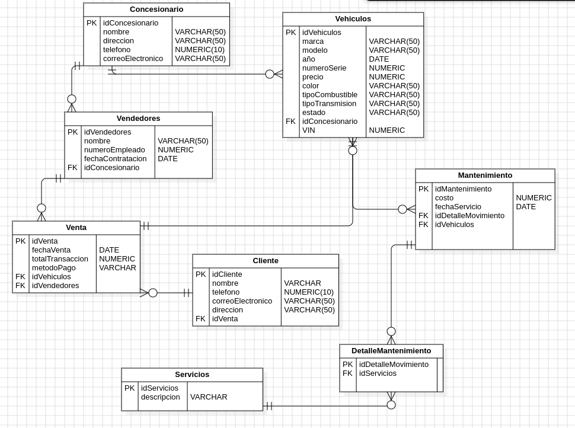

# EXAMEN UML-ER
    Base de datos para un concesionario de vehículos que gestione la información sobre los vehículos en stock, clientes, ventas, y servicios de mantenimiento. La base de datos debe permitir registrar y gestionar vehículos, vendedores, clientes, transacciones de ventas y servicios realizados. Los estudiantes deben crear un diagrama UML E-R que represente la estructura de la base de datos y entregar una documentación detallada que explique las decisiones de diseño, las relaciones entre las tablas y las restricciones impuestas.
    
## Entidades y atributos

### Concesionario
    NIT
    nombre
    direccion

### Vehiculos 
    Marca
    Modelo
    Año
    Numero Serie(VIN)
    Precio
    Color
    Tipo Combustible
    Tipo transmisión
    Estado(nuevo, usado)
    idConcesionario
    Debe tener disponibilidad actualizada en el inventario

### Cliente
    Nombre
    Teléfono
    Correo Electrónico
    Direccion
    idVenta
    
### Vendedores
    Nombre
    Numero Empleado
    Fecha Contratacion
    idConcesionario

### Ventas
    Fecha Venta
    Total Transaccion
    Metodo Pago(Tarjeta, Tranferencia)
    idVehiculos

### Mantenimiento
    TipoServicio(Preventivo, correctivo)
    Costo
    FechaServicio
    idDetallerMovimiento
    idVehiculos
    Los vehiculos pueden recibir mantenimiento

### Detaller Movimiento
    idDetallerMovimiento
    idServicios

### Servicios
    Descrpcion
    idDetallerMovimiento

## Justificacion de Diseño 

    -Concesionario - Vehículos: Un concesionario tiene muchos vehículos (relación de 1 a N).
    -Concesionario - Vendedores: Un concesionario tiene varios vendedores (relación de 1 a N).
    -Vehículos - Mantenimiento: Un vehículo puede tener múltiples mantenimientos (relación de 1 a N).
    -Ventas - Vehículos: Un vehículo puede estar involucrado en varias ventas, pero cada -venta se refiere a un solo vehículo (relación de N a 1).
    -Ventas - Clientes: Un cliente puede realizar muchas compras, pero cada venta es realizada a un solo cliente (relación de N a 1).
    -Ventas - Vendedores: Un vendedor puede realizar muchas ventas (relación de N a 1).
    -Mantenimiento - DetalleMovimiento: Un mantenimiento está asociado a un detalle de movimiento específico (relación de N a 1).
    -DetalleMovimiento - Servicios: Un detalle de movimiento puede tener muchos servicios relacionados (relación de N a 1).
    -Se deb mantener la disponibilidad actualizada de los vehiculos en un inventario

## Diagrama UML E-R

    

